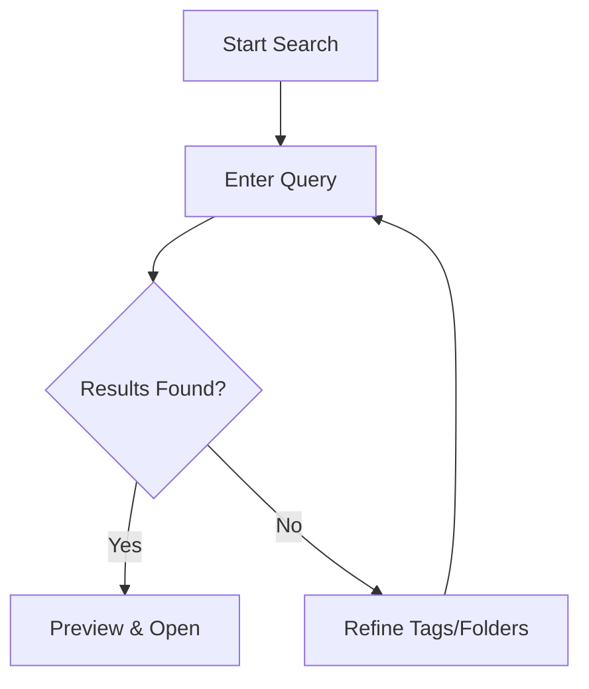

## Overview

Ahmad Abubakar provides powerful tools to streamline your documentation workflows. You can create, organize, and maintain docs with intuitive features for teams and solo projects. Focus on three core areas: page creation and editing, document organization using folders and tags, and robust search with version history.

<Columns cols={3}>
  <Card title="Page Creation & Editing" icon="edit-3" href="#page-creation">
    Build pages quickly with rich text, code blocks, and embeds.
  </Card>
  <Card title="Organization" icon="folder" href="#organization">
    Structure docs with folders and tags for easy navigation.
  </Card>
  <Card title="Search & History" icon="search" href="#search-history">
    Find content instantly and track changes over time.
  </Card>
</Columns>

## Page Creation and Editing Workflows

Start new pages directly from the dashboard or sidebar. The editor supports markdown, MDX components, and real-time previews.

<Steps>
  <Step title="Create a New Page" icon="plus">
    Click the `<kbd>New Page</kbd>` button in the sidebar.

    Select a template like "Guide" or "API Reference".
  </Step>
  <Step title="Edit Content" icon="edit">
    Use the visual editor for headings, lists, and images.

````markdown
## Example Section

Add your content here.

- Bullet points
- Code blocks
```
````
  </Step>
  <Step title="Publish" icon="upload">
    Preview changes, then click `<kbd>Publish</kbd>`.

    Share via public URL: `https://docs.ahmadabubakar.com/your-page`.
  </Step>
</Steps>

<Callout kind="tip">
  Enable collaborative editing to allow team members to contribute in real-time.
</Callout>

## Document Organization with Folders and Tags

Keep your docs structured without complexity. Folders provide hierarchy, while tags enable cross-project filtering.

<Tabs>
  <Tab title="Folders" icon="folder">
    Create nested structures for logical grouping.

    <Steps>
      <Step title="Add Folder">
        Right-click in sidebar → `<kbd>New Folder</kbd>`.
      </Step>
      <Step title="Move Pages">
        Drag pages into folders for reorganization.
      </Step>
    </Steps>
  </Tab>
  <Tab title="Tags" icon="tag">
    Apply tags for dynamic organization.

    <CodeGroup tabs="UI,API">
````javascript
// Example: Add tags via API
POST https://api.ahmadabubakar.com/docs/{pageId}/tags
{
  "tags": ["guide", "team"]
}
````

````bash
curl -X POST https://api.ahmadabubakar.com/docs/{pageId}/tags \\
  -H "Authorization: Bearer YOUR_API_KEY" \\
  -d '{"tags": ["guide", "team"]}'
````
    </CodeGroup>
  </Tab>
</Tabs>

## Search and Version History

Locate any document instantly with full-text search across all pages. Version history lets you revert changes or view diffs.

### Quick Search
Type in the top search bar to filter by title, content, or tags. Results update live with previews.

### Version History
Access history from the page menu (`<kbd>History</kbd>`).

<Expandable title="Advanced Version Features" default-open="false">
  Compare diffs between versions:

  | Action          | Shortcut       | Description                  |
  |-----------------|----------------|------------------------------|
  | View History    | `Ctrl+H`       | Open version timeline        |
  | Revert to Version | `Ctrl+R`     | Restore specific commit      |
  | Download Diff   | `Ctrl+D`       | Export changes as patch      |

  Restore via API:

````javascript
PATCH https://api.ahmadabubakar.com/docs/{pageId}/restore
{
  "versionId": "abc123"
}
````
</Expandable>

<Callout kind="info">
  Search indexes update within `<1s` of changes. Use tags like `draft` or `published` for filtering.
</Callout>



These features ensure your Ahmad Abubakar documentation stays organized and accessible as your projects grow.