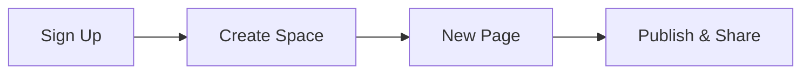

## Prerequisites

Before you begin, ensure you have:

- A modern web browser like Chrome, Firefox, or Safari
- An email address for account verification
- Internet connection

<Callout kind="info">

No credit card required for the free tier. Upgrade later as your projects grow.

</Callout>

## Create Your Account

Sign up in just two steps.

<Steps>
  <Step title="Visit the Dashboard" icon="monitor">
    Navigate to `https://app.ahmadabubakar.com` and click **Sign Up**.

    Fill in your email, password, and display name. Use a strong password with at least 12 characters.
  </Step>
  <Step title="Verify Email" icon="mail">
    Check your inbox for the verification email from Ahmad Abubakar.

    Click the verification link. If you don't see it, check your spam folder.
  </Step>
  <Step title="Log In" icon="log-in">
    Return to the dashboard and sign in with your credentials.

    You'll land on the main interface.
  </Step>
</Steps>

## Create Your First Documentation Space

Organize your projects by creating a dedicated space.

<Steps>
  <Step title="New Space" icon="plus">
    Click **New Space** in the top-right corner.

    Enter a name like "My Project Docs" and select a description.
  </Step>
  <Step title="Customize Settings" icon="settings">
    Choose your brand color (`#3B82F6` for blue theme) and default layout.

    Save to create the space.
  </Step>
  <Step title="Add First Page" icon="file-plus">
    Inside the space, click **New Page**.

    Title it "Introduction" and start editing.
  </Step>
</Steps>

## Basic Interface Tour

Explore the key areas using these tabs.

<Tabs>
  <Tab title="Dashboard" icon="layout-dashboard">
    View all your spaces and recent activity.

    Quick actions include searching docs and creating new pages.
  </Tab>
  <Tab title="Editor" icon="edit-3">
    The MDX editor supports live preview.

    Use the sidebar for pages, frontmatter, and components.
  </Tab>
  <Tab title="Settings" icon="settings">
    Manage branding, permissions, and integrations.

    Export your space as static HTML if needed.
  </Tab>
</Tabs>

## Build Your First Page

Create a simple page with frontmatter and content.

<CodeGroup tabs="MDX">
  ```mdx
  ---
  title: My First Page
  description: Welcome to my docs.
  ---

  ## Hello World

  This is your first documentation page.
  ```
</CodeGroup>

Copy the example above into your new page editor. Preview changes instantly.

<Callout kind="tip">

Save frequently with `Ctrl+S` (`Cmd+S` on macOS). Pages auto-publish on save.

</Callout>

## Next Steps

<Columns cols={3}>
  <Card title="Customize MDX" icon="code" href="#customize-mdx">
    Learn advanced components and syntax.
  </Card>
  <Card title="Manage Teams" icon="users" href="#teams">
    Invite collaborators to your space.
  </Card>
  <Card title="Integrations" icon="plug" href="#integrations">
    Connect with GitHub and other tools.
  </Card>
</Columns>



Your documentation space is ready! Explore the interface and build out your project docs.